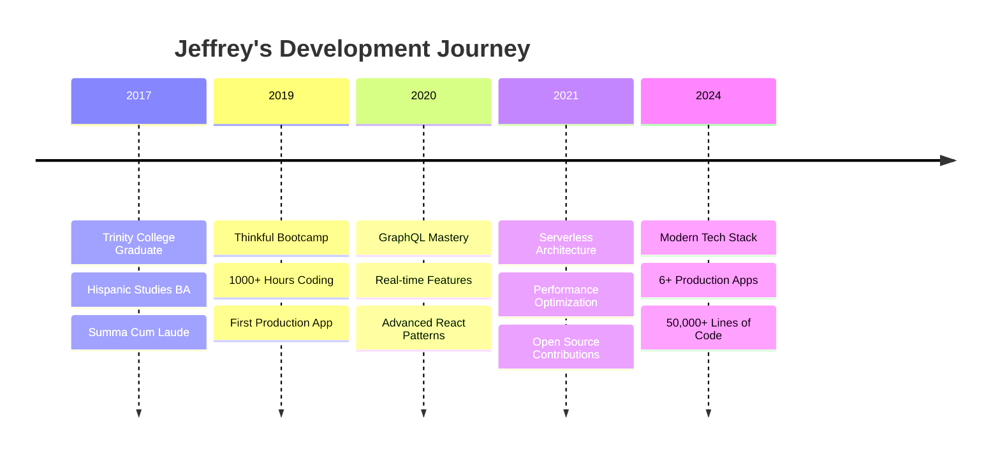

# <div align="center">🎯 **Jeffrey R. Maxwell** | Resume Portfolio</div>

<div align="center">

[](https://maxjeffwell.github.io/Resume/)
[](https://jekyllrb.com/)
[](https://pages.github.com/)
[](LICENSE)

</div>

<div align="center">

**Self-Taught Full-Stack Developer | Hispanic Studies Scholar**  
*Transforming ideas into elegant code since 2019* ✨

</div>

---

## 🚀 **Live Demo**

**👉 [View My Resume](https://maxjeffwell.github.io/Resume/) 👈**

<div align="center">
  <a href="https://maxjeffwell.github.io/Resume/">
    
  </a>
  <br/><br/>
  <em>✨ Interactive resume with animated gradients and smooth transitions ✨</em>
</div>

---

## 🎨 **Features**

<table>
<tr>
<td width="50%">

### ✨ **Visual Excellence**
- 🌈 **Animated gradients** throughout
- ⚡ **Smooth hover effects** on interactive elements  
- 🎭 **Glowing text animations** for emphasis
- 💫 **Pulsing metrics cards** with shine effects
- 📱 **Fully responsive** design

</td>
<td width="50%">

### 🛠️ **Technical Stack**
- 🔧 **Jekyll** static site generator
- 🎨 **Custom SCSS** with advanced animations
- 🌊 **Cayman theme** as base
- ⚙️ **GitHub Actions** for CI/CD
- 🚀 **GitHub Pages** hosting

</td>
</tr>
</table>

---

## 📁 **Repository Structure**

```
📦 Resume/
├── 🎨 assets/
│   └── css/
│       └── style.scss          # Custom flashy styling
├── ⚙️ .github/
│   └── workflows/
│       └── pages.yml           # Jekyll deployment pipeline
├── 📝 _layouts/
│   └── resume.html             # Custom resume layout
├── 📋 resume files/
│   ├── resume.md               # Original markdown
│   ├── resume-final.md         # Polished version
│   ├── resume-final.html       # HTML export
│   ├── Jeff_Maxwell_Resume.pdf # PDF version
│   └── resume-styles.css       # Standalone CSS
├── 🛠️ conversion scripts/
│   ├── convert-resume.sh       # Markdown to HTML
│   └── convert-with-css.sh     # HTML with styling
├── ⚙️ _config.yml              # Jekyll configuration
├── 📄 index.md                 # Main resume page
├── 💎 Gemfile                  # Ruby dependencies
└── 📖 README.md               # This file
```

---

## 🎯 **Highlights**

<div align="center">

| 💻 **Projects** | 🎓 **Education** | 🏆 **Achievements** | 🌟 **Skills** |
|:---------------:|:---------------:|:------------------:|:-------------:|
| **6+** Production Apps | **Thinkful** Bootcamp | **Phi Beta Kappa** | **React** Ecosystem |
| **GraphQL** APIs | **Trinity College** | **Summa Cum Laude** | **Node.js** Backend |
| **Real-time** Features | Hispanic Studies BA | **President's Fellow** | **Modern** JavaScript |
| **Serverless** Architecture | GPA: **3.91** | **Writing Center** | **Cloud** Deployment |

</div>

---

## 🔧 **Development Setup**

### **Prerequisites**
```bash
# Required tools
ruby >= 3.1
bundler
git
```

### **Local Development**
```bash
# Clone the repository
git clone https://github.com/maxjeffwell/Resume.git
cd Resume

# Install dependencies
bundle install

# Start local server
bundle exec jekyll serve

# View at http://localhost:4000/Resume/
```

### **Deployment**
```bash
# Automatic deployment via GitHub Actions
git push origin main

# Manual build (if needed)
bundle exec jekyll build --baseurl "/Resume"
```

---

## 🎨 **Customization Guide**

### **Color Scheme**
```scss
// Primary gradient
$primary-gradient: linear-gradient(-45deg, #667eea, #764ba2, #f093fb, #f5576c);

// Accent colors
$accent-blue: #667eea;
$accent-purple: #764ba2;
$accent-pink: #f093fb;
```

### **Animation Timing**
```scss
// Customize animation speeds
$glow-duration: 2s;
$gradient-duration: 15s;
$hover-duration: 0.3s;
```

---

## 📊 **Project Metrics**

<div align="center">


</div>

---

## 🌟 **Key Projects Showcased**

<details>
<summary><b>🎓 EducationELLy</b> - Full-Stack Educational Platform</summary>

- **Tech Stack:** React, Redux Toolkit, Node.js, MongoDB, JWT
- **Features:** Student management system with authentication
- **Highlights:** 15+ API endpoints, 85% test coverage
- **[Live Demo](https://educationelly-client-71a1b1901aaa.herokuapp.com/)** | **[Repository](https://github.com/maxjeffwell/educationELLy)**

</details>

<details>
<summary><b>💬 Code Talk</b> - Real-Time Collaborative Platform</summary>

- **Tech Stack:** GraphQL, Apollo, WebSockets, PostgreSQL, Redis
- **Features:** Live collaboration with instant messaging
- **Highlights:** DataLoader optimization, microservices architecture
- **[Repository](https://github.com/maxjeffwell/code-talk)**

</details>

<details>
<summary><b>🔖 Bookmarked</b> - Modern React Application</summary>

- **Tech Stack:** React 18, Hooks, PostgreSQL, Serverless
- **Features:** Bookmark management with serverless backend
- **Highlights:** Sub-second load times, PWA features
- **[Live Demo](https://bookmarks-react-hooks.vercel.app/)** | **[Repository](https://github.com/maxjeffwell/bookmarks-react-hooks)**

</details>

---

## 📈 **Learning Journey**



---

## 🤝 **Connect With Me**

<div align="center">

[](https://el-jefe.me)
[](mailto:jeff@el-jefe.me)
[](https://github.com/maxjeffwell)
[](tel:+15083952008)

</div>

---

## 📜 **License**

<div align="center">

This project is licensed under the **MIT License** - see the [LICENSE](LICENSE) file for details.

</div>

---

<div align="center">

**⭐ Star this repository if you found it helpful! ⭐**

*"Code is poetry written in logic"* ✨

</div>